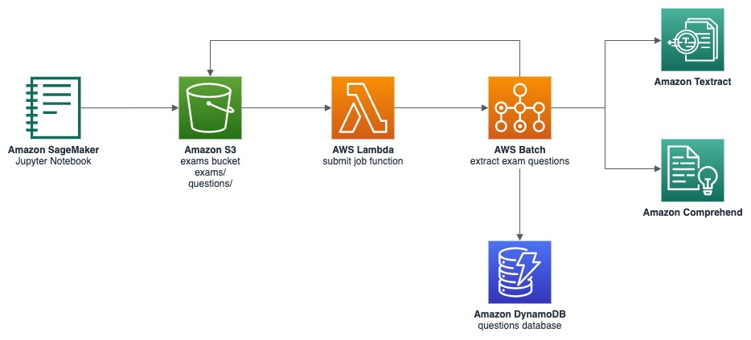
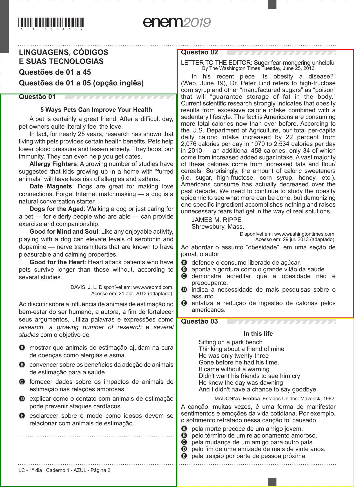
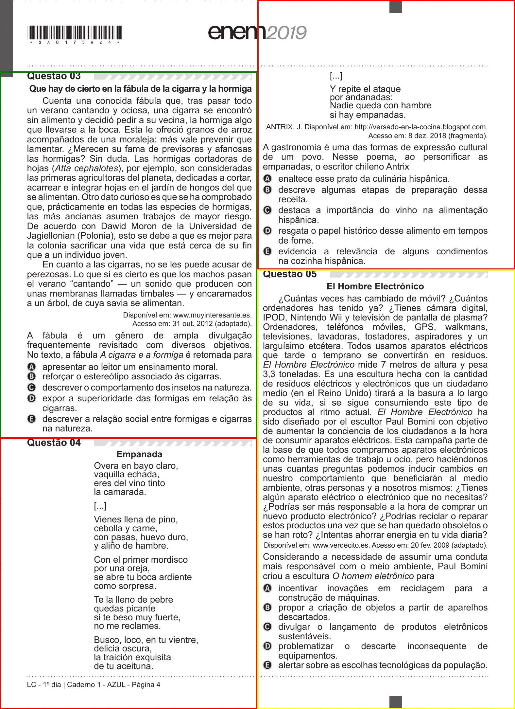
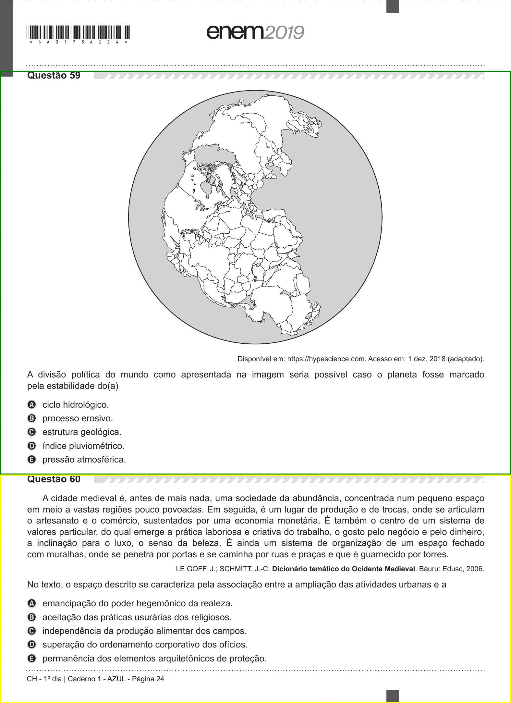

# AWS EDU Question Reader

Repository describing how to utilize AI/ML in AWS to extract questions from public exams, providing also template and code.

## Example with ENEM exam

### ENEM page layouts

*two columns:*

*two columns with broken question:*

*centered questions:*

